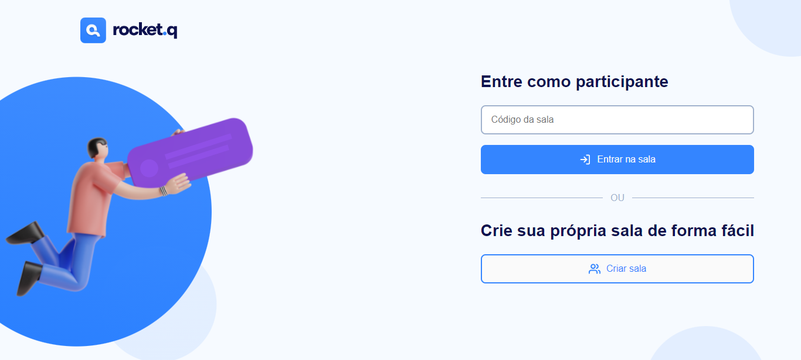
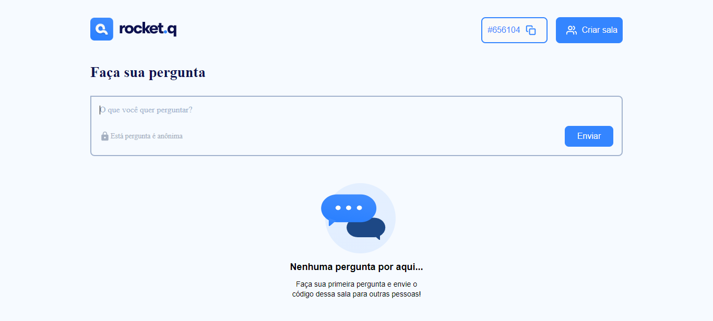
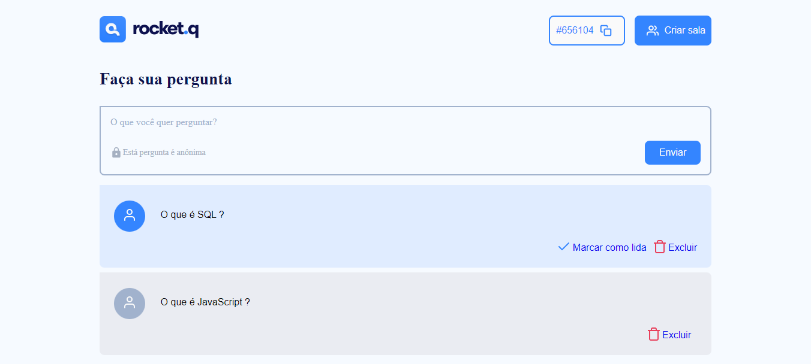
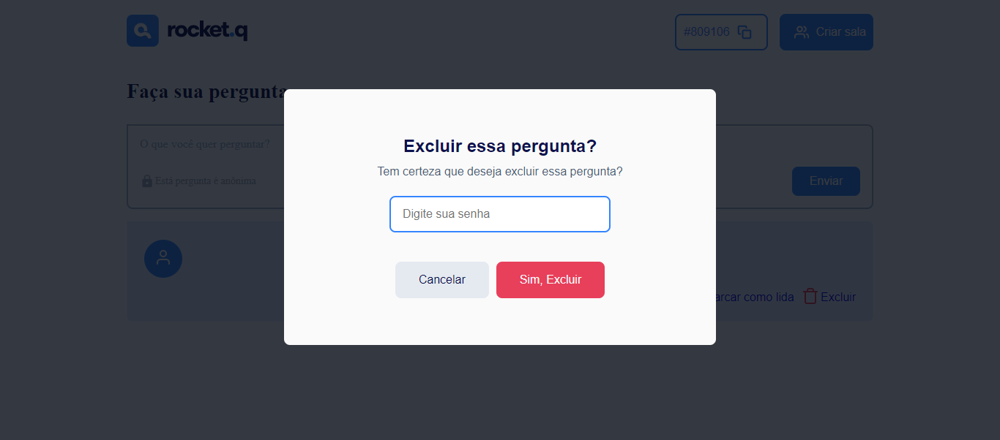

# central_de_perguntas
Projeto criado no bootcamp NLW Fundation, ministrado pela empresa rockeseat.

## Minha aplicação:

## Tecnologias utilizadas:
<ul>
  <li>HTML5</li>
  <li>CSS3</li>
  <li>JavaScript</li>
  <li>Node js</li>
   <li>EJS</li>
  <li>SQLITE3</li>
</ul>

## Sobre a aplicação:

Esse sistema é uma central de perguntas, no qual, um usuário pode criar uma sala com uma determinada senha a sua escolha, essa sala possui um ID de acesso, 
para que somente os usuários com esse ID consigam ter acesso. Na sala qualquer usuário pode realizar perguntas ou comentários, mas somente os usuários 
com conhecimento da senha podem excluir ou  marcar como lida uma pergunta.

OBS: Para entrar em uma sala precisa ter previamente criado uma sala e salvado seu ID, a modal de aviso para usuáros que estão tentando entrar na sala errada 
está em construção.

## Por que esse sistema?

Esse sistema foi realizado por mim para desenvolvimento do portfólio pessoal, com esse projeto consegui aprender sobre como criar controladores para as rotas
da nossa aplicação e sobre como criar e manipular um banco de dados usando SQL.

## Ficaria feliz com Feedbacks:

Email: raphaeldesousalm@gmail.com  
Linkdin: https://www.linkedin.com/in/raphaellima98/

